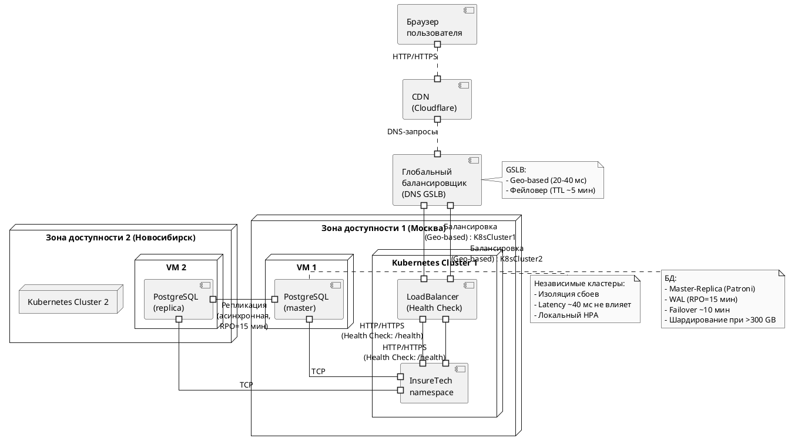

# InsureTech: Проектирование технологической архитектуры (Задание 1)

## Цели и требования
Компания InsureTech планирует развиваться в регионах России, ожидая значительный рост пользователей и запросов. Требуется архитектура, обеспечивающая:
- **Круглосуточную работу (24/7)** для всех часовых поясов РФ (UTC+2 до UTC+12).
- **Отказоустойчивость**: RTO = 45 мин (время восстановления), RPO = 15 мин (потеря данных), доступность = 99,9% (макс. downtime 8,76 часов/год).
- **Одинаковое время загрузки страниц** независимо от географии пользователя.
- **Поддержка данных**: 50 GB (ФИО, контакты, документы, продукты, заявки) с учётом роста.

## Текущая архитектура
- Монолитный core-app и микросервисы в одном Kubernetes-кластере.
- PostgreSQL на одной ВМ без реплик.
- Развёртывание в одной зоне доступности.

## Предлагаемая архитектура
Спроектирована географически распределённая система с двумя зонами: Москва (AZ1) и Новосибирск (AZ2). Решение обеспечивает масштабируемость, отказоустойчивость и низкие задержки.

### 1. Стратегия масштабирования и отказоустойчивости
- **Вертикальное масштабирование**:
    - **Описание**: Увеличение ресурсов (CPU, RAM, диск) для существующих узлов (например, VM с PostgreSQL или Kubernetes worker nodes).
    - **Плюсы**:
        - Быстрая реализация без изменения архитектуры.
        - Подходит для текущего объёма данных (50 GB) и нагрузки (50 RPS на поиск, 10 RPS на оформление).
    - **Минусы**:
        - Ограничено пределами одной машины (например, 64 vCPU, 256 GB RAM).
        - Не решает проблему отказоустойчивости: сбой узла = полный отказ.
        - Не масштабируется под резкий рост (например, до 500 RPS после рекламы).
    - **Оценка**: Эффективно как временная мера, но не соответствует долгосрочным требованиям 99,9% доступности.

- **Горизонтальное масштабирование**:
    - **Описание**: Добавление узлов в Kubernetes-кластеры и реплик БД в разных зонах.
    - **Плюсы**:
        - Линейный рост производительности с добавлением ресурсов.
        - Повышает отказоустойчивость за счёт распределённости (сбой одной зоны не останавливает сервис).
        - Подходит для highload (например, 1000 RPS).
    - **Минусы**:
        - Требует настройки балансировки, репликации и мониторинга.
        - Увеличивает операционные расходы (OPEX).
    - **Оценка**: Оптимально для роста пользователей и требований бизнеса.

- **Решение**:
    - Приоритет горизонтальному масштабированию через независимые кластеры Kubernetes в двух зонах.
    - **Обоснование**:
        - Гибкость: добавление узлов проще и дешевле, чем апгрейд серверов.
        - Отказоустойчивость: multi-AZ снижает риск полного отказа (сравните с текущей одной зоной, где downtime стоил 500 тыс. руб/час).
        - Производительность: распределяет нагрузку между регионами, поддерживая одинаковое время отклика.

- **Дополнительные зоны**:
    - **Решение**: Да, две зоны (Москва и Новосибирск).
    - **Обоснование**:
        - Одна зона не обеспечивает 99,9% доступности (сбой дата-центра = часы простоя).
        - Две зоны покрывают РФ (запад и восток), минимизируя задержки (Москва ~20 мс для Калининграда, Новосибирск ~40 мс для Владивостока).
        - Третья зона (например, Екатеринбург) избыточна для текущих 50 GB и нагрузки.

### 2. Развёртывание в нескольких зонах
#### a. Конфигурация Kubernetes
- **Решение**: Независимые кластеры в каждой зоне (K8sCluster1 в AZ1, K8sCluster2 в AZ2).
- **Обоснование**:
    - **Изоляция сбоев**: Сбой в AZ1 (например, отключение питания) не затрагивает AZ2, поддерживая 99,9% доступности.
    - **Упрощённое управление**: Каждый кластер автономен, нет риска сетевых задержек между регионами (Москва-Новосибирск ~40 мс).
    - **Гибкость**: Локальный HPA адаптируется под региональную нагрузку (например, больше подов в AZ2 при пике в Сибири).
- **Альтернатива**:
    - Растянутый кластер через VPN или VPC peering.
    - Отклонено из-за сложности синхронизации (latency ~40 мс увеличивает время отклика) и единой точки отказа (сбой control plane = отказ всего кластера).

#### b. Балансировка нагрузки
- **Решение**:
    - **CDN (Cloudflare)**: Кэширует статический контент (страницы, изображения), снижая нагрузку на серверы.
    - **Глобальный балансировщик (DNS GSLB)**: Распределяет трафик по географии (Москва для запада, Новосибирск для востока) и доступности.
    - **Локальные LoadBalancer’ы**: Проверяют здоровье сервисов через `/health` (HTTP 200 OK, timeout 5 сек).
- **Обоснование**:
    - **Одинаковое время загрузки**: CDN сокращает latency до ~10-20 мс для любого региона, GSLB направляет к ближайшей зоне.
    - **Отказоустойчивость**: Health Check исключает нерабочие узлы, GSLB переключает трафик при сбое (например, 250 RPS от партнёра не перегрузят систему).
    - **Масштабируемость**: Распределение трафика между зонами предотвращает перегрузку (в отличие от текущего LoadBalancer’а).

#### c. Фейловер-стратегия
- **Решение**:
    - GSLB переключает трафик на доступную зону (TTL DNS ~5 мин).
    - PostgreSQL использует Patroni для автоматического переключения на реплику.
- **Обоснование**:
    - **RTO=45 мин**: DNS-обновление (~5 мин) + переключение БД (~10 мин) = ~15 мин, что ниже лимита.
    - **Доступность 99,9%**: Multi-AZ минимизирует downtime (в текущей архитектуре часы простоя стоили 500 тыс. руб).
    - **Простота**: Не требует клиентских изменений, GSLB и Patroni автоматизируют процесс.

#### d. Конфигурация базы данных
- **Репликация**:
    - **Решение**: Master (AZ1) → Replica (AZ2) с асинхронной репликацией через WAL.
    - **Обоснование**:
        - **RPO=15 мин**: WAL записывает изменения каждые 10-15 мин, обеспечивая минимальную потерю данных.
        - **Производительность**: Асинхронность не тормозит запись на master (синхронная репликация добавила бы ~40 мс latency).

- **Failover**:
    - **Решение**: Patroni для автоматического переключения на реплику.
    - **Обоснование**:
        - **RTO=45 мин**: Patroni переключает за ~5-10 мин, плюс DNS (~5 мин), итого ~15 мин.
        - **Надёжность**: Проверенный инструмент для HA PostgreSQL, минимизирует ручное вмешательство.

- **Резервное копирование**:
    - **Решение**: pgBackRest для ежедневных бэкапов на S3.
    - **Обоснование**: Защищает от катастроф (например, удаление данных), дополняя репликацию.

- **Шардирование**:
    - **Анализ**:
        - Текущий объём: 50 GB (например, 1 млн клиентов × 50 KB/запись).
        - Рост: при 10 млн заявок в год (500 RPS × 60 сек × 3600 ч × 10%) объём может достичь 500 GB за 1-2 года.
        - PostgreSQL справляется с 1-2 TB на одной ноде при оптимизации.
    - **Решение**: Пока не применять шардирование, но мониторить рост и подготовить разделение по регионам (AZ1 для запада, AZ2 для востока).
    - **Обоснование**:
        - **Экономия**: Шардирование сейчас усложнит репликацию и управление без явной выгоды (50 GB — малая нагрузка).
        - **Гибкость**: Master-Replica достаточно до 500-1000 GB, затем шардирование по ключу (например, client_id).
        - **Рекомендация**: Переход при достижении 300 GB (60% от порога).

### Дополнительно: Мониторинг
- **Решение**: Prometheus + Grafana для метрик (latency, RPS, uptime), алерты через Alertmanager.
- **Обоснование**:
    - **Доступность 99,9%**: Проактивное обнаружение сбоев (в текущей архитектуре команда узнавала от пользователей).
    - **Масштабируемость**: Метрики для HPA и анализа узких мест (например, 250 RPS от партнёра).

## Схема развертывания

## Итог
- **Доступность 99,9%**: Multi-AZ, GSLB, Patroni, мониторинг.
- **RTO=45 мин, RPO=15 мин**: Репликация WAL, failover Patroni.
- **Одинаковое время загрузки**: CDN (~10 мс), GSLB (~20-40 мс).
- **Масштабируемость**: Горизонтальное расширение, шардирование отложено.
